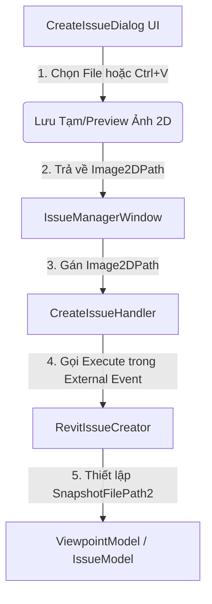

# Tổng Hợp Code & Logic Triển Khai: Redesign Create Issue Dialog

Tài liệu này tổng hợp toàn bộ các thay đổi về mã nguồn (code) và logic nghiệp vụ được áp dụng để thiết kế lại cửa sổ **CreateIssueDialog** trong dự án **Antigravity.IssueManager**.

---

## 1. Kiến Trúc Luồng Dữ Liệu (Data Flow)

Khi người dùng nhấn nút tạo Issue mới, luồng xử lý thông tin ảnh 2D diễn ra như sau:



---

## 2. Chi Tiết Các Thay Đổi & Mã Nguồn

### 2.1. Giao Diện Người Dùng (XAML)
**File:** [CreateIssueDialog.xaml](file:///E:/Antigravity/RevitAddinSolution/src/Antigravity.IssueManager/UI/CreateIssueDialog.xaml)

*   **Logic:** 
    *   Tăng kích thước cửa sổ lên `860x560` để có đủ không gian hiển thị hai panel ảnh cạnh nhau.
    *   Sử dụng Grid chia 2 cột chính (`ColumnDefinition Width="*"`).
    *   Vì lớp `Border` mặc định trong WPF không hỗ trợ nét đứt (`StrokeDashArray`), vùng ảnh 2D được bổ sung một thẻ `Rectangle` vẽ đè lên trên với thuộc tính `StrokeDashArray="4 2"` và `IsHitTestVisible="False"` để tạo hiệu ứng đường viền đứt nét (dashed border) hiện đại.

```xml
<!-- Khung hình ảnh 3D (Trái) -->
<Border Grid.Column="0" BorderBrush="#3333AA" BorderThickness="1.5" CornerRadius="4" Background="#0D0D4A" Padding="8">
    <Grid>
        <Grid.RowDefinitions>
            <RowDefinition Height="Auto"/>
            <RowDefinition Height="*"/>
        </Grid.RowDefinitions>
        <TextBlock Grid.Row="0" Text="Hình ảnh 3D (Revit Snapshot)" Foreground="White" FontWeight="SemiBold" FontSize="12" Margin="0,0,0,6"/>
        <Grid Grid.Row="1">
            <Image x:Name="ImgPreview3D" Stretch="Uniform" VerticalAlignment="Center" HorizontalAlignment="Center"/>
            <TextBlock x:Name="TxtHint3D" Text="(Chụp tự động từ Revit khi bấm Create Issue)" Foreground="#8888CC" FontStyle="Italic" TextAlignment="Center" VerticalAlignment="Center" TextWrapping="Wrap" Margin="10"/>
        </Grid>
    </Grid>
</Border>

<!-- Khung hình ảnh 2D (Phải) -->
<Grid Grid.Column="2">
    <Border BorderBrush="#3333AA" BorderThickness="1.5" CornerRadius="4" Background="#0D0D4A" Padding="8">
        <Grid>
            <Grid.RowDefinitions>
                <RowDefinition Height="Auto"/>
                <RowDefinition Height="*"/>
                <RowDefinition Height="Auto"/>
            </Grid.RowDefinitions>
            <TextBlock Grid.Row="0" Text="Hình ảnh 2D" Foreground="White" FontWeight="SemiBold" FontSize="12" Margin="0,0,0,6"/>
            
            <Grid Grid.Row="1" Margin="0,0,0,6">
                <Image x:Name="ImgPreview2D" Stretch="Uniform" VerticalAlignment="Center" HorizontalAlignment="Center"/>
                <TextBlock x:Name="TxtHint2D" Text="Ctrl+V để dán ảnh, hoặc bấm 📁 để chọn file" Foreground="#8888CC" FontStyle="Italic" TextAlignment="Center" VerticalAlignment="Center" TextWrapping="Wrap" Margin="10"/>
            </Grid>

            <StackPanel Grid.Row="2" Orientation="Horizontal" HorizontalAlignment="Center">
                <Button x:Name="BtnPickImage2D" Content="📁 Chọn ảnh..." Click="BtnPickImage2D_Click" Padding="10,5" Background="#3A3A8A" Foreground="White" BorderThickness="0" Cursor="Hand" Margin="0,0,8,0"/>
                <Button x:Name="BtnClearImage2D" Content="✖ Xóa ảnh" Click="BtnClearImage2D_Click" Padding="10,5" Background="#5A3A3A" Foreground="White" BorderThickness="0" Cursor="Hand" Visibility="Collapsed"/>
            </StackPanel>
        </Grid>
    </Border>
    <!-- Viền nét đứt đè lên -->
    <Rectangle Stroke="#4444FF" StrokeThickness="1" StrokeDashArray="4 2" RadiusX="4" RadiusY="4" IsHitTestVisible="False"/>
</Grid>
```

---

### 2.2. Logic Code-Behind & Xử Lý Clipboard
**File:** [CreateIssueDialog.xaml.cs](file:///E:/Antigravity/RevitAddinSolution/src/Antigravity.IssueManager/UI/CreateIssueDialog.xaml.cs)

*   **Logic:**
    *   Đăng ký phím tắt hệ thống `ApplicationCommands.Paste` vào Window CommandBindings để bắt sự kiện `Ctrl+V`.
    *   Khi người dùng dán dữ liệu:
        *   Nếu là dữ liệu ảnh trực tiếp từ bộ nhớ đệm (`Clipboard.ContainsImage()`), chuyển đổi sang file `.png` lưu tạm tại thư mục `%TEMP%\AntigravityIssueManager`.
        *   Nếu người dùng copy tệp ảnh từ Windows Explorer (`Clipboard.ContainsFileDropList()`), lọc lấy đường dẫn tệp ảnh hợp lệ đầu tiên và trích xuất.
    *   Phương thức `LoadImage2DPreview` sử dụng `BitmapCacheOption.OnLoad` giúp giải phóng file ảnh ngay sau khi load vào giao diện WPF, tránh bị lock file.

```csharp
public CreateIssueDialog()
{
    InitializeComponent();
    this.CommandBindings.Add(new CommandBinding(ApplicationCommands.Paste, OnPasteExecuted));
}

private void OnPasteExecuted(object sender, ExecutedRoutedEventArgs e)
{
    if (Clipboard.ContainsImage())
    {
        BitmapSource bitmapSource = Clipboard.GetImage();
        string tempPath = SaveBitmapSourceToTemp(bitmapSource);
        if (tempPath != null)
            LoadImage2DPreview(tempPath);
    }
    else if (Clipboard.ContainsFileDropList())
    {
        var files = Clipboard.GetFileDropList();
        foreach (string file in files)
        {
            string ext = System.IO.Path.GetExtension(file).ToLower();
            if (ext == ".png" || ext == ".jpg" || ext == ".jpeg" || ext == ".bmp")
            {
                LoadImage2DPreview(file);
                break;
            }
        }
    }
}

private static string SaveBitmapSourceToTemp(BitmapSource source)
{
    try
    {
        string dir = System.IO.Path.Combine(System.IO.Path.GetTempPath(), "AntigravityIssueManager");
        System.IO.Directory.CreateDirectory(dir);
        string path = System.IO.Path.Combine(dir, $"clipboard_{DateTime.Now:yyyyMMdd_HHmmss}.png");

        using (var stream = new System.IO.FileStream(path, System.IO.FileMode.Create))
        {
            var encoder = new PngBitmapEncoder();
            encoder.Frames.Add(BitmapFrame.Create(source));
            encoder.Save(stream);
        }
        return path;
    }
    catch { return null; }
}

private void LoadImage2DPreview(string path)
{
    try
    {
        var bitmap = new BitmapImage();
        bitmap.BeginInit();
        bitmap.UriSource = new Uri(path);
        bitmap.CacheOption = BitmapCacheOption.OnLoad; // Tránh khóa file ảnh
        bitmap.EndInit();

        ImgPreview2D.Source = bitmap;
        TxtHint2D.Visibility = Visibility.Collapsed;
        BtnClearImage2D.Visibility = Visibility.Visible;
        Image2DPath = path;
    }
    catch (Exception ex)
    {
        MessageBox.Show($"Không thể tải ảnh: {ex.Message}", "Lỗi", MessageBoxButton.OK, MessageBoxImage.Warning);
    }
}
```

---

### 2.3. Cầu Nối Truyền Dữ Liệu
**File:** [IssueManagerWindow.xaml.cs](file:///E:/Antigravity/RevitAddinSolution/src/Antigravity.IssueManager/UI/IssueManagerWindow.xaml.cs) và [CreateIssueHandler.cs](file:///E:/Antigravity/RevitAddinSolution/src/Antigravity.IssueManager/Handlers/CreateIssueHandler.cs)

*   **Logic:** Đảm bảo thuộc tính `Image2DPath` được chuyển tiếp liền mạch từ Dialog giao diện vào tiến trình luồng Event ngoài của Revit.

```csharp
// Trong IssueManagerWindow.xaml.cs (BtnCreateIssue_Click)
_createIssueHandler.Title = dialog.IssueTitle;
_createIssueHandler.Description = dialog.IssueDescription;
_createIssueHandler.Image2DPath = dialog.Image2DPath; // Chuyển đường dẫn ảnh sang handler
_createIssueHandler.IncludeSectionBoxClipPlanes = ChkIncludeSectionBox.IsChecked == true;
_createIssueHandler.UseSharedCoordinates = ChkUseSharedCoordinates.IsChecked == true;
_createIssueEvent.Raise();

// Trong CreateIssueHandler.cs (Execute)
IssueModel newIssue = RevitIssueCreator.CreateIssueFromCurrentView(
    app,
    Title,
    Description,
    IncludeSectionBoxClipPlanes,
    UseSharedCoordinates,
    Image2DPath); // Truyền tham số ảnh 2D vào service tạo Issue
```

---

### 2.4. Lưu Trữ Thông Tin Ảnh 2D
**File:** [RevitIssueCreator.cs](file:///E:/Antigravity/RevitAddinSolution/src/Antigravity.IssueManager/Services/RevitIssueCreator.cs)

*   **Logic:** Nhận tham số đường dẫn ảnh 2D tùy chọn (`image2DPath = null`) và lưu trữ nó vào trường dữ liệu `SnapshotFilePath2` của viewpoint thuộc IssueModel.

```csharp
public static IssueModel CreateIssueFromCurrentView(
    UIApplication uiApp,
    string title,
    string description,
    bool includeSectionBoxClipPlanes,
    bool useSharedCoordinates,
    string image2DPath = null)
{
    // ... logic thu thập thông tin tọa độ camera Revit ...
    
    return new IssueModel
    {
        // ... các tham số khởi tạo ...
        Viewpoint = new ViewpointModel
        {
            // ... các camera coordinates ...
            SnapshotFilePath = snapshotPath,  // Ảnh 3D tự động chụp từ Revit
            SnapshotFilePath2 = image2DPath   // Ảnh 2D do người dùng tải lên/dán
        }
    };
}
```

---

## 3. Tổng Kết
Hệ thống hoạt động ổn định nhờ cơ chế bắt sự kiện dán đa dạng (hỗ trợ cả ảnh thô lẫn tệp ảnh trong Clipboard) kết hợp giải phóng bộ nhớ cache ảnh nhanh (`BitmapCacheOption.OnLoad`), đảm bảo không gây ra hiện tượng rò rỉ bộ nhớ hoặc khóa file bất thường trong môi trường modless của Revit API.
